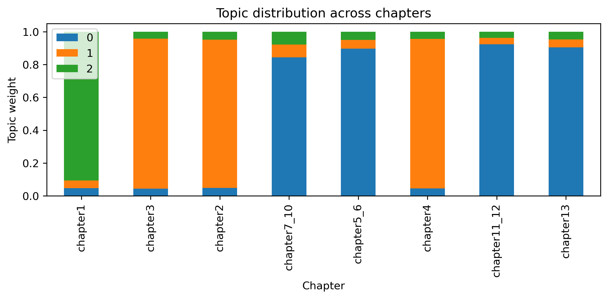
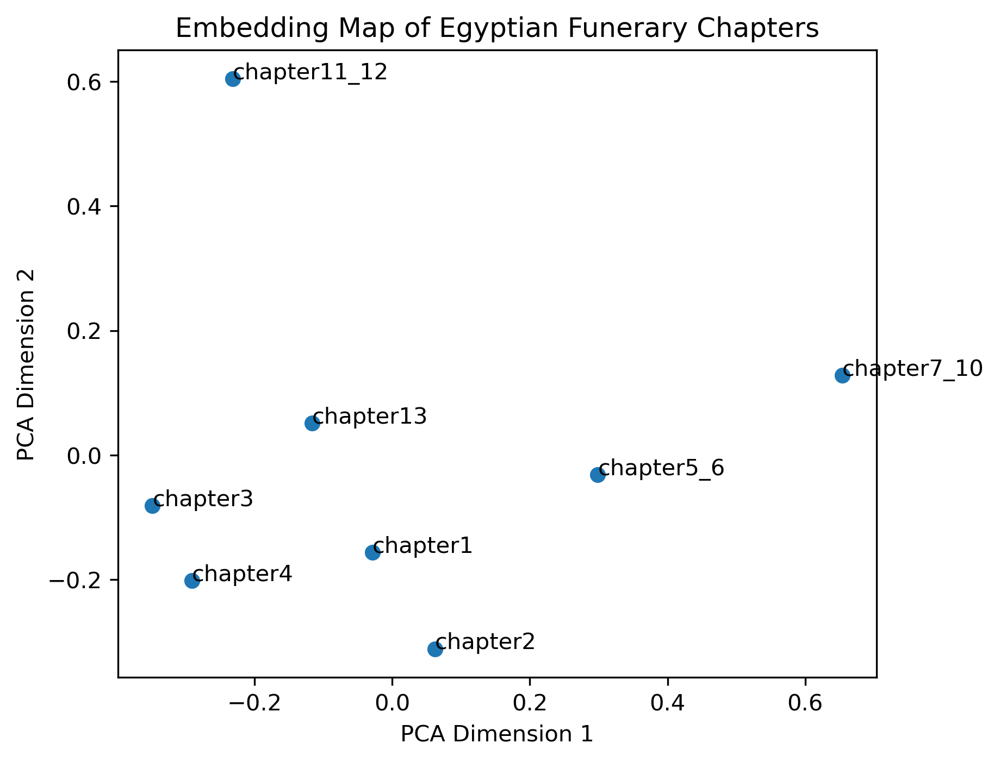
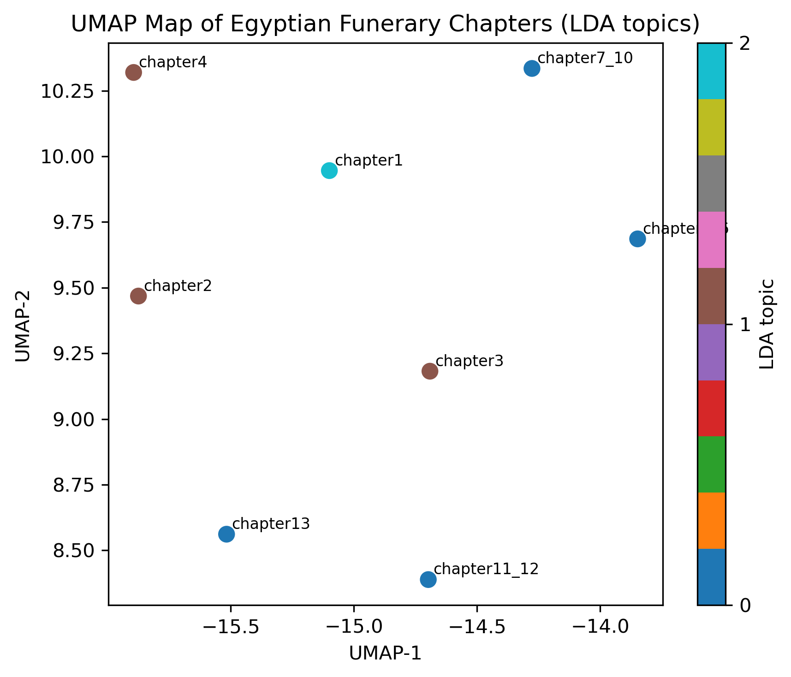
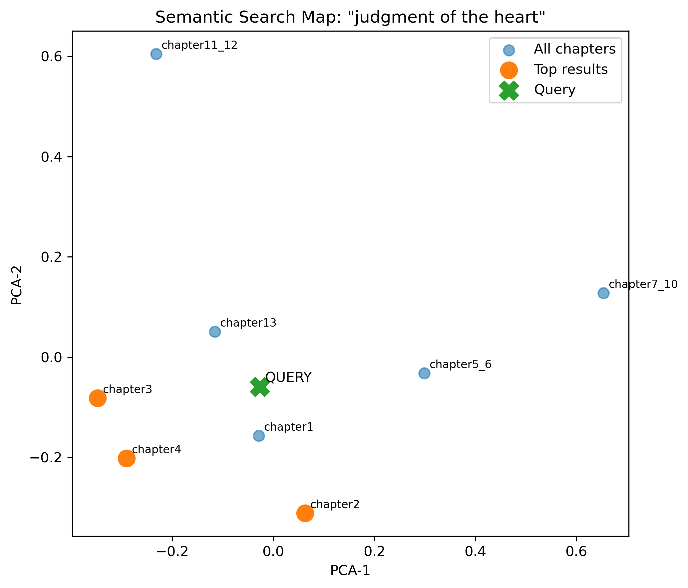
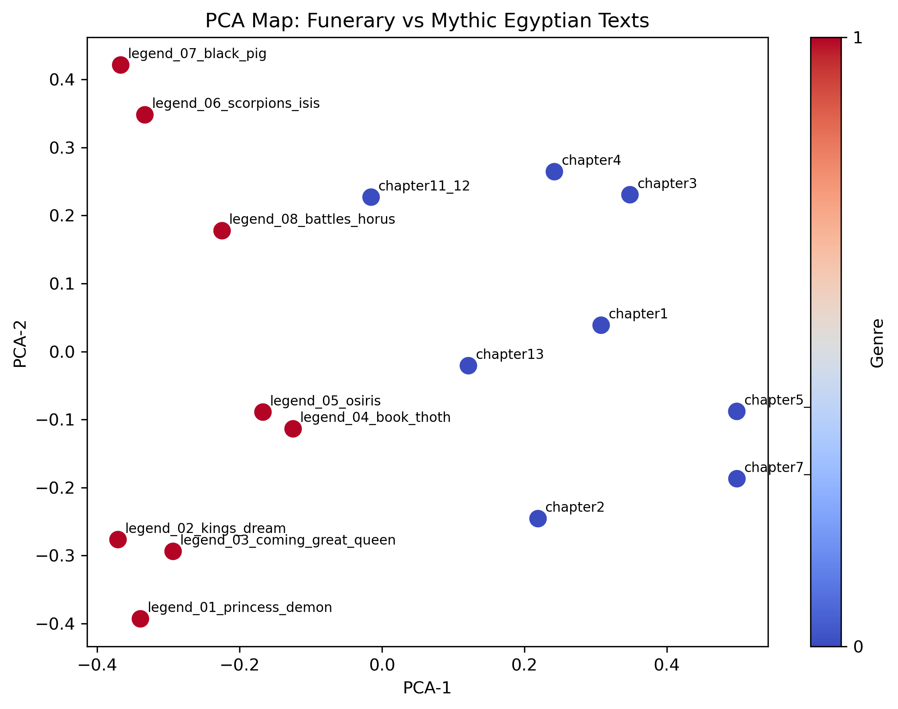
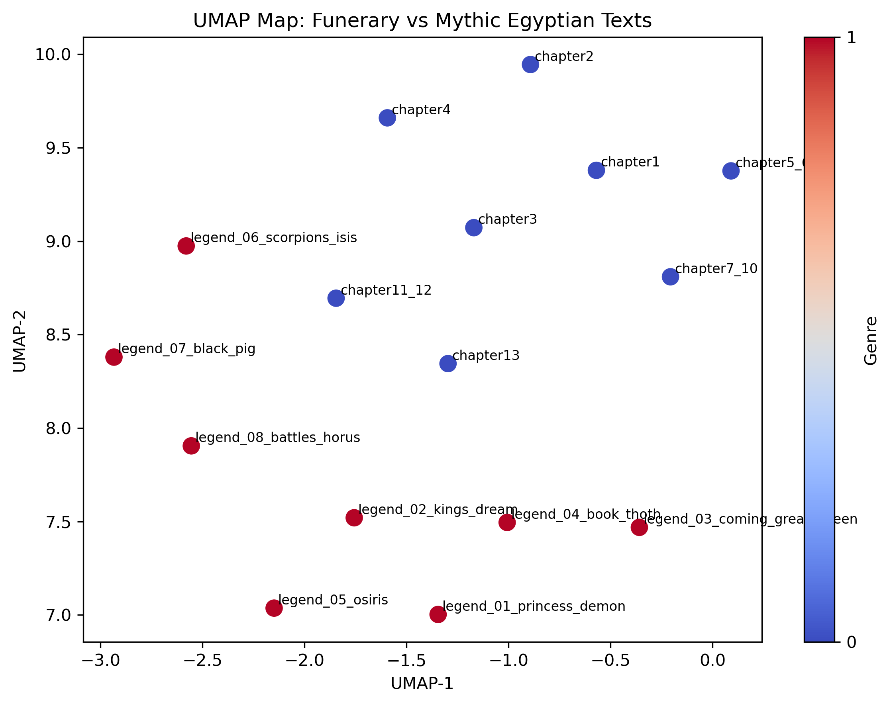
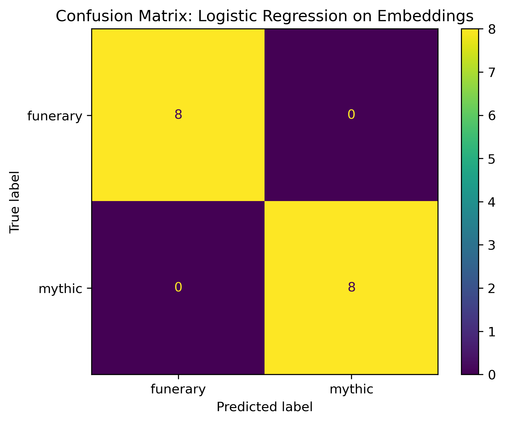
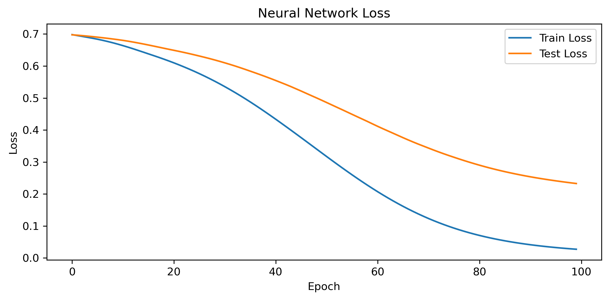
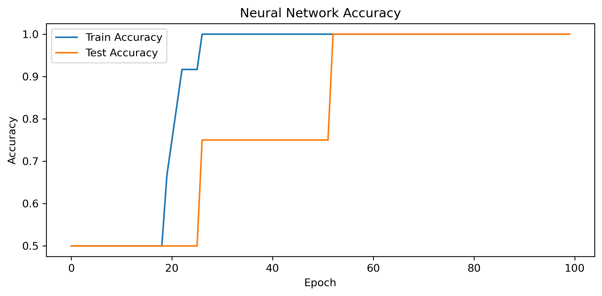

# Ancient Egyptian Texts — Analyzed with AI


*A project exploring ancient Egyptian funerary and mythic texts using topic modeling, embeddings, clustering, semantic search, and neural networks.*

---

## Overview

Can modern AI help us understand texts written thousands of years ago?

This project applies Natural Language Processing (NLP) techniques to English translations of ancient Egyptian texts, especially chapters from the *Book of the Dead* and mythic narrative texts.

The project asks three main questions:

- What themes appear in funerary texts?
- Which chapters are most similar in meaning?
- Can a machine learning model distinguish funerary texts from mythic stories?

---

## Quick Takeaways

- Topic modeling recovered meaningful themes such as solar praise, judgment, and underworld passages.
- Embeddings placed semantically related chapters close together in vector space.
- Semantic search retrieved relevant passages based on ideas, not just keyword overlap.
- Funerary and mythic texts separated clearly in embedding space.
- Linear classifiers achieved **93.75% cross-validation accuracy**.
- A small neural network also learned the distinction on a held-out test split.

---

## Project Structure

| Project | Focus | Main Goal |
|--------|-------|-----------|
| **Project 1** | Topic Modeling | Discover recurring themes in *Book of the Dead* chapters |
| **Project 2** | Embeddings + Search | Compare chapters by meaning and build semantic search |
| **Project 3** | Genre Classification | Distinguish funerary texts from mythic texts |
| **Project 4** | Neural Network | Train a small classifier with backpropagation |

---

## Project 1 — Topic Modeling

This section uses **TF-IDF** and **Latent Dirichlet Allocation (LDA)** to uncover recurring themes in funerary texts.

### Main themes discovered
- ☀️ Solar praise and hymnic language
- ⚖️ Judgment, the heart, and petitions
- 🚪 Underworld passages and Osirian material

These themes align well with the known religious and ritual structure of the *Book of the Dead*.

### Visualization



*Each bar shows how strongly a chapter aligns with the discovered themes.*

---

## Project 2 — Embedding-Based Clustering and Semantic Search

This section uses **sentence embeddings** to represent each chapter in semantic space.

That makes it possible to:
- compare chapters by meaning
- cluster related chapters
- visualize chapter relationships
- search by concept rather than exact wording

### PCA Map of Funerary Chapters



*Chapters that appear close together in the map share similar meaning.*

### UMAP Map with Topic Labels



*UMAP gives another view of semantic structure, with points colored by LDA topic.*

### Semantic Search Example

A query such as **“judgment of the heart”** retrieves the most relevant chapters even when exact phrasing differs.



*The query is projected into the same semantic space as the chapters.*

---

## Project 3 — Funerary vs Mythic Classification

This section combines:

- **8 funerary texts**
- **8 mythic texts**

and tests whether embeddings can distinguish the two genres.

### Methods used
- KMeans clustering
- Logistic Regression
- Linear SVM

### Main result
Both Logistic Regression and Linear SVM achieved:

**93.75% mean cross-validation accuracy**

### PCA Genre Map



*Funerary and mythic texts occupy different regions in embedding space.*

### UMAP Genre Map



*The two genres remain clearly separated in a non-linear projection.*

### Confusion Matrix



*Inspection of full-dataset predictions after fitting the final logistic regression model.*

---

## Project 4 — Small Neural Network with Backpropagation

This final section reuses the sentence embeddings and trains a small **feed-forward neural network** in PyTorch.

The goal is to show how a learnable classifier can be trained using **backpropagation**.

### Neural network training curves



*Loss decreases steadily during training.*



*Accuracy improves quickly on this small dataset.*

### Interpretation

The neural network learned the funerary-versus-mythic distinction successfully on the held-out split used in the notebook. Because the dataset is very small, this result should be interpreted cautiously.

---

## Key Findings

- Ancient funerary texts show clear thematic structure.
- Embeddings capture semantic similarity across chapters.
- Semantic search works effectively for concept-based retrieval.
- Funerary and mythic texts are strongly distinguishable.
- Simple linear models already perform extremely well.
- A small neural model can also learn the distinction, though the dataset is too small for strong generalization claims.

---

## Limitations

- The project analyzes **English translations**, not original ancient Egyptian texts.
- The dataset is **very small**: only 16 total documents in the genre classification task.
- Some results, especially neural network performance, may vary across train/test splits.

---

## 🛠️ Technologies Used

- Python
- pandas
- numpy
- matplotlib
- scikit-learn
- nltk
- sentence-transformers
- umap-learn
- PyTorch
- Jupyter Notebook

---

## How to Run

1. Clone the repository:
```bash
git clone https://github.com/Juhij2/ancient-egypt-nlp.git

2. Install dependencies:
pip install -r requirements.txt

3. Open the notebook:
jupyter notebook

4. Run the notebook step by step.
```

## Author
Juhi Jadhav
